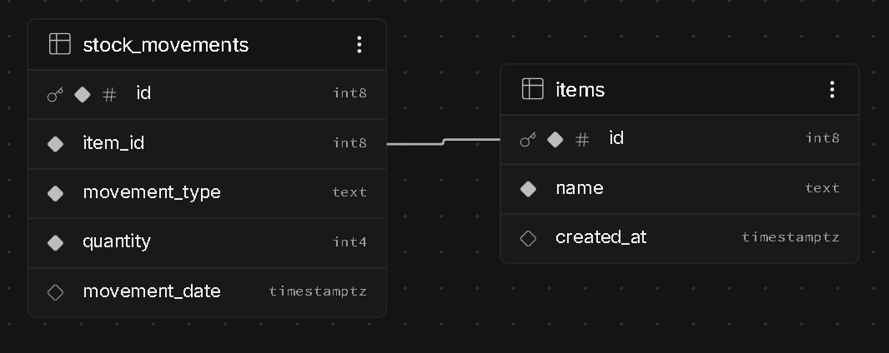

# item-movement-system
Simple Item Movement System using Supabase and GitHub Pages
## Database Schema & ER Diagram

- **items (1)**: Master list of tracked items.
- **stock_movements (∞)**: Log of IN/OUT movements linked by `item_id`.